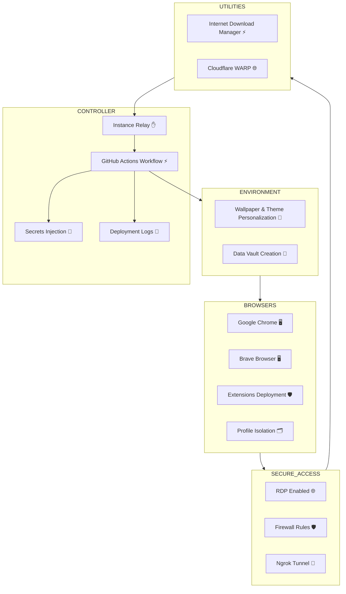

# ⚡🌀✋ EnigMano Windows 11 Deployment — Your Tactical Fortress Commander

---

**EnigMano 🌀✋** is forged from two powerful concepts:

* **Enigma 🌀** — a puzzle wrapped in shadows, precision, and quiet strength.
* **Mano ✋** — the “hand” that commands, controls, and executes with unwavering resolve.

Together, **EnigMano** embodies *“The Hand of Mystery”* — a silent guardian orchestrating the life and legacy of every fortress instance with masterful precision and hidden grace. 🛡️

> **Project Focus:** This repository is part of the EnigMano ecosystem, dedicated to creating **RDP-enabled, fully automated Windows 11 instances**. Each instance is pre-configured, secure, and ready for remote deployment and operations.

---

## 🔥 What Is This? 🕵️‍♂️

This GitHub Actions workflow automates the deployment of **EnigMano Windows 11 instances**, preparing a **digital fortress environment** that includes:

* Visual personalization (wallpapers, themes)
* Multi-browser deployment (Chrome & Brave) with isolated profiles
* Essential extensions for privacy, productivity, and automation
* Secure remote access via RDP & encrypted ngrok tunnels
* Optional tools like **Internet Download Manager (IDM)** and **Cloudflare WARP**

Everything runs automatically, creating **self-sufficient, ready-to-use workstations**.

---

## 🚀 Features & Highlights ⚡

* Full **Windows 11 instance orchestration** 🖥️
* Automatic **environment personalization** 🎨
* Multi-browser deployment: **Chrome & Brave**
* **13 curated extensions** installed silently across isolated profiles 🛡️
* Secure access with **RDP, firewall, and ngrok tunnel** 🌐
* Automated software deployments: IDM & Cloudflare WARP ⚡
* **Data vault** creation on desktop for organized storage 📂
* Step-by-step **logging & status reporting** 📝
* Automated **instance handoff** via GitHub Actions ✋
* Graceful shutdown and cleanup of instances ⏹️

---

## 🗓️ Mission Timeline & Phases ⏱️

| Phase                   | Duration (Minutes) | Role in the Campaign                          | Emoji |
| ----------------------- | ------------------ | --------------------------------------------- | ----- |
| **Active Sentinel 🛡️** | 330                | Instance fully active, tools & browsers ready | 🛡️   |
| **Relay Preparation ✋** | 5                  | Deploys next instance automatically           | ✋     |
| **Final Countdown ⏹️**  | 5                  | Graceful shutdown & cleanup                   | ⏹️    |

* **Total Mission Time:** 340 minutes ⏱️
* **Relay Trigger:** At 330 minutes ✋
* **Shutdown Command:** At 335 minutes ⏹️

---

## ⚡ Fortress Overview 🏰

| Parameter               | Value / Action                                                                                                                                                                                                                                 |
| ----------------------- | ---------------------------------------------------------------------------------------------------------------------------------------------------------------------------------------------------------------------------------------------- |
| Workflow Trigger        | Manual, enter **INSTANCE** number ✋                                                                                                                                                                                                            |
| Runner                  | Windows (`windows-2025`) 💻                                                                                                                                                                                                                  |
| Secrets Required        | `SECRET_SHAHZAIB`, `NGROK_SHAHZAIB` 🔐                                                                                                                                                                                                         |
| Chrome & Brave Profiles | 3 isolated profiles per browser 🖥️                                                                                                                                                                                                            |
| Extensions Installed    | WebRTC Protect 🛡️, Video Quality Settings 🎥, Random YouTube Video 🎲, Proton VPN 🔒, Stop Autoplay Next ⏹️, YouTube Nonstop 🔁, uBlock Origin 🚫, Ghostery 👻, Tab Auto Refresh 🔄, Adguard, IDM Integration Module, YouTube Ad Auto Skipper |
| Personalization         | Wallpaper & theme applied via PowerShell 🎨                                                                                                                                                                                                    |
| Secure Access           | RDP enabled, firewall configured, ngrok tunnel 🌐                                                                                                                                                                                              |
| Mission Duration        | 340 minutes ⏱️                                                                                                                                                                                                                                 |
| Logs & Reporting        | Step-by-step deployment + final status 📝                                                                                                                                                                                                      |

---

## 🎯 Usage 🎮

1. Fork this repository and enable Actions 🍴
2. Open your repo's **Actions** tab 🔍
3. Select the **EnigMano Windows 11 Deployment** workflow ✋
4. Click **Run workflow** ▶️
5. Enter **INSTANCE** number (default: 1) 🔢
6. Confirm & watch your Windows 11 fortress deploy ⚔️

---

## 🔐 Prerequisites 🛡️

* Runner: **windows-2025** (Windows 11 environment) 🖥️
* GitHub secrets configured:

  * `SECRET_SHAHZAIB` 🔑
  * `NGROK_SHAHZAIB` 🌐

---

## ⚠️ Notes & Tips ⚠️

* Keep your secrets **secure and confidential** 🔒
* Use only in **private and secure environments** 🕵️‍♂️
* Ensure network allows RDP and outbound connections for ngrok 🌐
* Monitor logs for step-by-step deployment confirmation 📝

---

## 🙌 Credits 🛡️

Built & maintained by **SHAHZAIB-YT** — orchestrating Windows 11 fortresses with tactical precision. 🔋

---

Ready to deploy your **EnigMano Windows 11 fortress**? Command the silent hand now! 🌀✋🛡️

---

## 🖼️ Visual Architecture Diagram 🌀✋

> **Diagram Explanation:**
> This architecture shows how the **EnigMano Windows 11 instance** is orchestrated: environment personalization → browser & extension deployment → secure access → utility tools → instance handoff → repeat for multi-instance operations.
